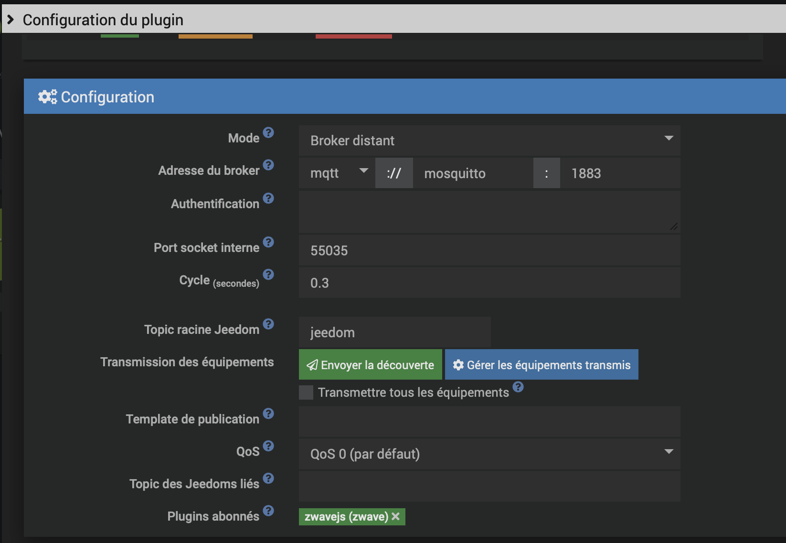

# Jeedom Hub for Home Assistant


Jeedom Hub is a Home Assistant custom integration that listens to Jeedom MQTT discovery and
event topics, then creates entities in Home Assistant. It can also execute Jeedom commands
through JSON-RPC (with optional HTTP fallback).

## Features
- Native entity creation from Jeedom MQTT discovery payloads.
- Optional MQTT entities mode (let Home Assistant's MQTT integration handle discovery).
- Per-domain filtering and optional device overrides via a config file.
- JSON-RPC command execution with HTTP fallback.

## Requirements
- Home Assistant with the MQTT integration enabled.
- A Jeedom instance with an API key.
- Jeedom publishing MQTT discovery and event messages:
  - `jeedom/discovery/eqLogic/#`
  - `jeedom/cmd/event/#`

## Jeedom-side setup (MQTT Manager)
The Jeedom MQTT Manager plugin is required.

1. Install and enable the MQTT Manager plugin.
2. Configure the broker connection (host, port, credentials if needed).
3. Keep the Jeedom root topic as `jeedom` (default).
4. In the plugin configuration:
   - Use the green button to publish discovery (send equipment to MQTT).
   - Use the blue button to select which devices are broadcast.



## Installation
### HACS (custom repository)
1. Open HACS and add this repository as a custom integration.
2. Install "Jeedom Hub".
3. Restart Home Assistant.

### Manual
1. Copy `custom_components/jeedomhub` into your Home Assistant `config/custom_components`.
2. Restart Home Assistant.

## Configuration (UI)
Go to Settings -> Devices & Services -> Add Integration -> "Jeedom Hub".

Fields:
- `host`: Jeedom base URL or hostname.
- `port`: Jeedom port (default 8080).
- `api_key`: Jeedom API key.
- `name`: Name shown in Home Assistant.
- `protocol`: `mqtt` or `api` (default `mqtt`).
- `import_mode`: `native` creates entities in this integration; `mqtt_entities` uses the MQTT
  integration and creates no entities here.
- `domains`: Domains to create in Home Assistant.
- `config_path`: Optional path to a discovery config file (leave empty to import all devices).
- `use_jsonrpc`: Enable JSON-RPC command execution.
- `jsonrpc_fallback`: Fallback to HTTP if JSON-RPC fails.
- `jsonrpc_url`: Optional JSON-RPC URL override.

## Options
These can be updated after setup via the integration options:
- `import_mode`
- `domains`
- `config_path`
- `use_jsonrpc`
- `jsonrpc_fallback`
- `jsonrpc_url`

## Supported domains (native mode)
- `binary_sensor`
- `alarm_control_panel`
- `climate`
- `cover`
- `light`
- `number`
- `select`
- `sensor`
- `switch`
- `water_heater`

## Optional discovery config file
You can filter devices and override entity details with a YAML file. Set `config_path`
to the file path on your Home Assistant host.

Example (`/config/jeedomhub.yaml`):
```yaml
defaults:
  include_all_if_no_filter: true
  global_generic_whitelist:
    - TEMPERATURE
    - HUMIDITY

devices:
  - match:
      eqlogic_id: 1234
    device_name: Living Room Sensor
    slug: living_room
    include:
      generic_types:
        - TEMPERATURE
        - HUMIDITY
    entity_overrides:
      5678:
        name: Living Room Temperature
        # For binary sensors, invert the on/off state:
        # inverted: true

  - match:
      eqlogic_name: "Living Room Heater"
    # Optional: force the platform for this device (supported: light, switch, cover,
    # number, select, climate, water_heater, alarm_control_panel).
    platform: water_heater
    include:
      cmd_ids: [2001, 2002, 2003]

  - match:
      eqlogic_name: "RFID Keypad"
    platform: alarm_control_panel
    # Optional: override the alarm state mapping for this device.
    # You can also set this under entity_overrides for the Alarm cmd id.
    alarm_control_panel:
      state_map:
        "0": disarmed
        "1": armed_away
```
Notes:
- `platform` is an eqLogic-level override; it skips auto-detection for the main entity.
- `sensor`/`binary_sensor` entities are still detected per-command.
- `inverted: true` on a binary sensor flips the on/off state (useful when a device reports `1` for off and `0` for on).

## MQTT topics
- Discovery: `jeedom/discovery/eqLogic/#`
- Events: `jeedom/cmd/event/#`

## Troubleshooting
- Verify the Jeedom MQTT messages are published to the topics above.
- Check the API key, host, and port.
- Enable debug logs for `custom_components.jeedomhub` to inspect discovery parsing.

## Contributing
Issues and feature requests are welcome. Please use the repository issue tracker.
